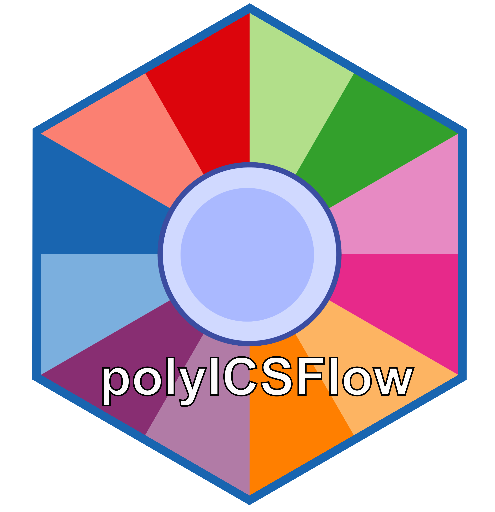
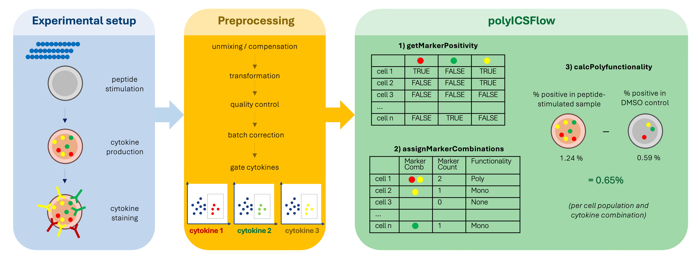

# polyICSFlow

<!-- badges: start -->

<!-- badges: end -->



Identifying the Frequency of Polyfunctional Antigen-Specific T cells in ICS Flow Cytometry Data.

## Citation

If you use this package, please cite:

``` r
citation("polyICSFlow")
```

## Installation

You can install the development version of polyICSFlow from [GitHub](https://github.com/) with:

``` r
# install.packages("pak")
pak::pak("SoegaardLab/polyICSFlow")
```

Or from Bioconductor

``` r
if (!require("BiocManager"))
    install.packages("BiocManager")
BiocManager::install("polyICSFlow")
```

## How it works

polyICSFlow systematically identifies all cytokine combinations detected in an intracellular cytokine staining (ICS) flow cytometry assay and quantifies polyfunctional antigen-specific responses to single or multiple antigens. The package requires as input preprocessed data gated on the cytokines of interest.

polyICSFlow is designed as a sequential workflow of three functions, where the output of each function serves as the input to the next:

1.  **getMarkerPositivity()** generates a cell-by-marker positivity matrix
2.  **assignMarkerCombinations()** assigns marker combinations to each cell
3.  **calcPolyfunctionality()** computes frequencies and background-subtracted responses



Check out function documentation and the vignettes:

``` r
browseVignettes("polyICSFlow")
```
